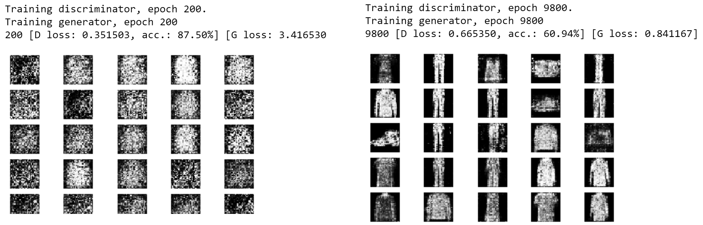

## GAN model using fashion-mnist dataset  
### week 6 assignment
---

* the dataset was imported with: from keras.datasets import fashion_mnist
* the notebooks were created in Windows 10

---
Requirements:

__future__
keras
matplotlib
sys
numpy

---
#### Acknowledgement: Based on [Suresh's github repo](https://github.com/R-Suresh/GAN_fashion_MNIST)